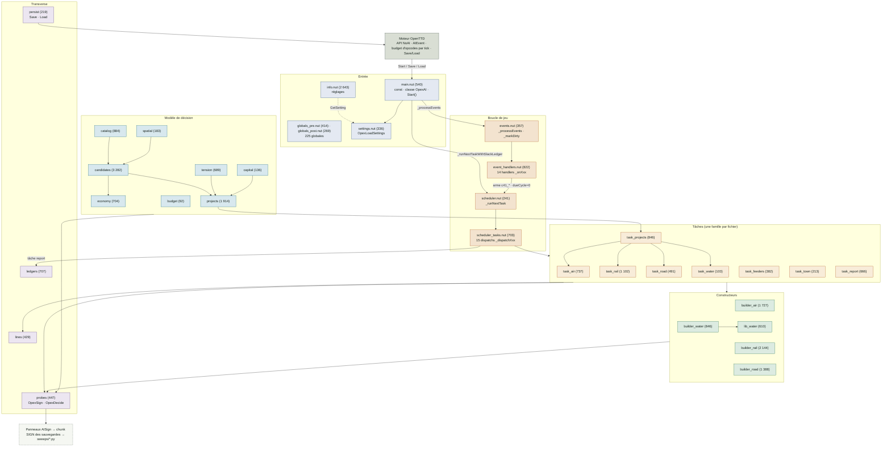
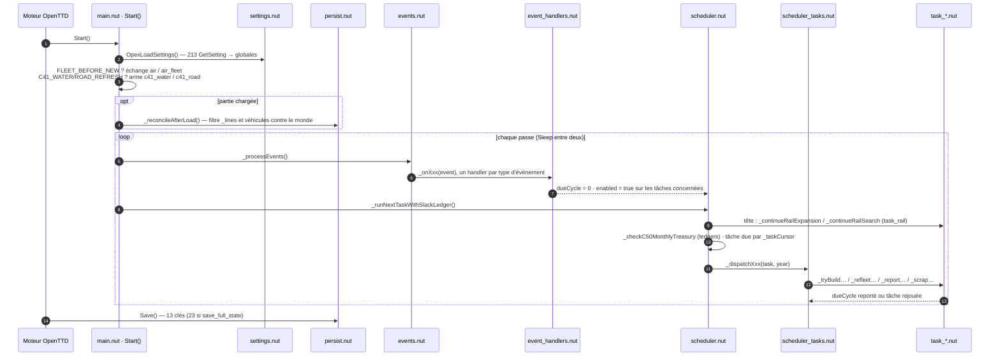
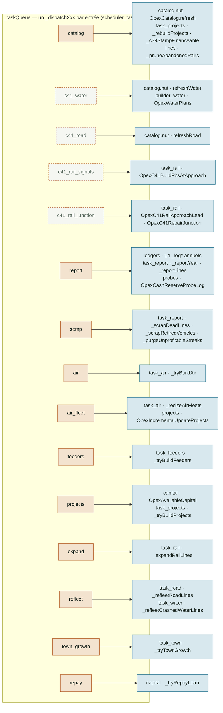
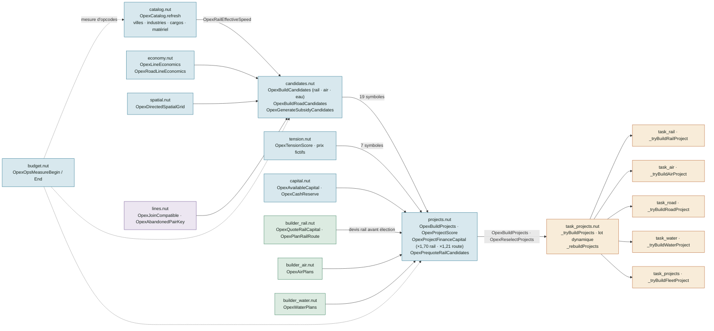
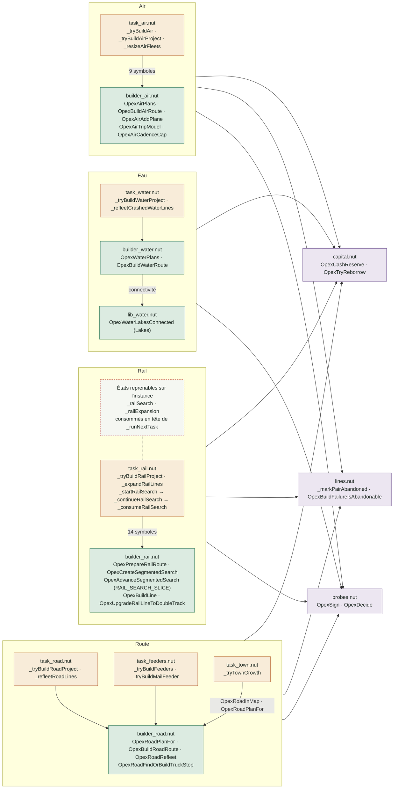
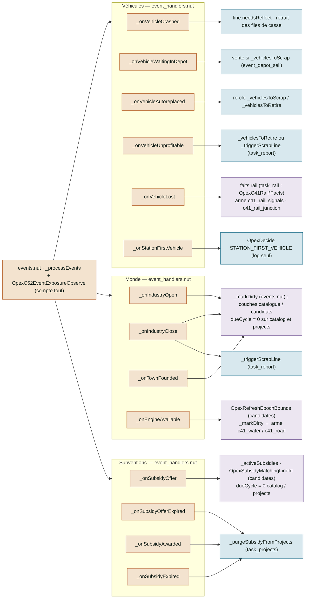
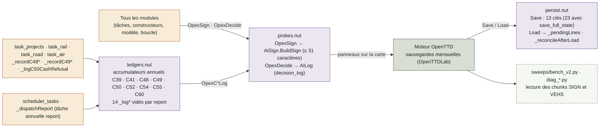

# Architecture d'`ai/OpexAI/` — schémas

État relevé le 2026-09-13 après la clôture de C65 (passes 1 à 3) : 34 fichiers `.nut`,
27 266 lignes, `main.nut` réduit à 540 lignes. Les arêtes des schémas viennent du graphe
d'appels extrait par grep (symbole défini dans A, référencé dans le code de B) ; l'annexe donne
la matrice complète. Les tailles sont en lignes.

## Rôle de chaque fichier

| Couche | Fichier | Lignes | Rôle et symboles d'entrée |
|---|---|---:|---|
| Entrée | `info.nut` | 2 643 | `OpexAIInfo` : déclaration des réglages et drapeaux d'expérience (`AddSetting`) |
| Entrée | `main.nut` | 540 | En-tête, `import`, 17 `const`, deux blocs `require`, classe `OpexAI` (champs, constructeur = file des 15 tâches, prototypes), `Start()` |
| Entrée | `globals_pre.nut` | 414 | 174 globales `X <-` chargées **avant** les modules du bloc 1 |
| Entrée | `globals_post.nut` | 269 | 51 globales chargées **après** le bloc 1 (`CASH_CANDIDATE_SCAN_LIMIT <- TOP_K` dépend de `candidates.nut`) |
| Entrée | `settings.nut` | 336 | `OpexLoadSettings()` : 213 `AIController.GetSetting` → globales, appelée par `Start()` |
| Boucle | `events.nut` | 357 | `_processEvents` (dispatch des `AIEvent`), `_markDirty`, `_logStalenessRefresh`, `OpexC52EventExposureObserve` |
| Boucle | `event_handlers.nut` | 822 | 14 handlers `_onVehicleCrashed` … `_onStationFirstVehicle` |
| Boucle | `scheduler.nut` | 241 | `_runNextTaskWithSlackLedger`, `_runNextTask` : tête reprenable (rail) puis dispatch par `task.name` |
| Boucle | `scheduler_tasks.nut` | 703 | 15 dispatchs `_dispatchCatalog` … `_dispatchRepay` |
| Tâche | `task_air.nut` | 737 | `_tryBuildAir`, `_tryBuildAirProject`, `_resizeAirFleets`, `_markAirFailedSites`, `OpexAirBatch*`, `OpexAirFleet*` |
| Tâche | `task_rail.nut` | 1 102 | `_tryBuildRailProject`, `_expandRailLines`, `_startRailSearch` / `_continueRailSearch` / `_consumeRailSearch`, `_continueRailExpansion`, `_recordRailAttempt`, `_startRailUpgradeSearch` / `_consumeRailUpgrade`, helpers de réparation `OpexC41Rail*` |
| Tâche | `task_road.nut` | 491 | `_tryBuildRoadProject`, `_refleetRoadLines` |
| Tâche | `task_water.nut` | 103 | `_tryBuildWaterProject`, `_refleetCrashedWaterLines`, `OpexWaterBatchSiteStillBuildable` |
| Tâche | `task_feeders.nut` | 382 | `_tryBuildFeeders`, `_tryBuildMailFeeder`, `OpexFeederCandidateCompare`, `OpexMailRollbackStop(s)` |
| Tâche | `task_projects.nut` | 846 | `_tryBuildProjects`, `_rebuildProjects`, lot dynamique (`_refreshDynamicBatch`, `_dynamicBatchBuilt`, `_dynamicBatchRejected`, `_stopDynamicBatch`), `_tryBuildFleetProject`, `_c39StampFinanceable`, `_purgeSubsidyFromProjects` |
| Tâche | `task_town.nut` | 213 | `_tryTownGrowth`, `OpexCountTownStations`, `OpexGetServedTowns` |
| Tâche | `task_report.nut` | 666 | `_reportYear`, `_reportLines`, `_scrapDeadLines`, `_scrapRetiredVehicles`, `_purgeUnprofitableStreaks`, `_triggerScrapLine` |
| Constructeur | `builder_rail.nut` | 2 144 | Pose du rail : `OpexPrepareRailRoute`, A* segmenté reprenable (`OpexCreateSegmentedSearch`, `OpexAdvanceSegmentedSearch`, `RAIL_SEARCH_SLICE`), `OpexBuildLine`, `OpexQuoteRailCapital`, `OpexUpgradeRailLineToDoubleTrack` |
| Constructeur | `builder_air.nut` | 1 727 | Aéroports et lignes : `OpexAirPlans`, `OpexBuildAirRoute`, `OpexAirAddPlane`, `OpexAirTripModel`, `OpexAirCadenceCap`, `OpexAirDemandCap` |
| Constructeur | `builder_road.nut` | 1 388 | Routes, arrêts, dépôts : `OpexRoadPlanFor`, `OpexBuildRoadRoute`, `OpexRoadRefleet`, `OpexRoadFindOrBuildTruckStop` |
| Constructeur | `builder_water.nut` | 846 | Quais et navires : `OpexWaterPlans`, `OpexBuildWaterRoute`, `OpexWaterRefleetCrashedShip` (chantier non fini) |
| Constructeur | `lib_water.nut` | 610 | Transcription MinchinWeb Lakes : `OpexWaterLakesConnected`, `OpexWaterLakesInstance` ; `import("queue.fibonacci_heap")` |
| Modèle | `catalog.nut` | 884 | `OpexCatalog` : villes, industries, cargos, matériel roulant (`refresh`, `refreshWater`, `refreshRoad`), physique rail (`OpexRailEffectiveSpeed`) |
| Modèle | `candidates.nut` | 3 282 | Génération des candidats : `OpexBuildCandidates` (rail/air/eau), `OpexBuildRoadCandidates`, `OpexRoadFeederCandidates`, `OpexGenerateSubsidyCandidates`, bandes de distance, note municipale (C60) |
| Modèle | `economy.nut` | 704 | Économie d'une ligne : `OpexLineEconomics`, `OpexRoadLineEconomics`, `OpexRoadPhysicalVehicleCap`, `OpexStationRatingForHeadway` |
| Modèle | `projects.nut` | 1 914 | Portefeuille : `OpexBuildProjects`, `OpexProjectScore`, `OpexProjectFinanceCapital` (biais ×1,70 rail / ×1,21 route), `OpexPrequoteRailCandidates`, `OpexIncrementalUpdateProjects` |
| Modèle | `tension.nut` | 689 | Score de tension et prix fictifs : `OpexTensionScore`, `OpexTensionComputeShadowPrices`, `OpexTensionEnable` |
| Modèle | `spatial.nut` | 183 | `OpexSpatialGrid`, `OpexDirectedSpatialGrid` (index des origines fret, C46) |
| Modèle | `capital.nut` | 136 | `OpexCashReserve`, `OpexAvailableCapital`, `OpexTryReborrow`, `_tryRepayLoan` |
| Modèle | `budget.nut` | 92 | `OpexBudget`, `OpexOpsMeasureBegin` / `OpexOpsMeasureEnd` (mesure d'opcodes) |
| Transverse | `lines.nut` | 429 | Identité et registre des lignes : `OpexFindLineForVehicle`, `OpexLineVehicleIds`, `OpexFindStationJoin`, `OpexAbandonedPairKey`, `_markPairAbandoned`, `_tooClose`, `_findLineById` |
| Transverse | `probes.nut` | 447 | Canal de mesure : `OpexSign` (panneaux `AISign`), `OpexDecide` (journal `AILog`), tous les `OpexC*Log` / `Observe` |
| Transverse | `ledgers.nut` | 707 | Registres annuels C39/C41/C48/C49/C50/C52/C54/C55/C60 (`_record*`, `_log*`), `_checkC50MonthlyTreasury` |
| Transverse | `persist.nut` | 219 | `Save` (13 clés courtes / 23 complètes), `Load`, `_reconcileAfterLoad` |

## D1 — Vue en couches

## D2 — Ordre de chargement

Deux contraintes Squirrel fixent cet ordre : `main.nut` est compilé **entier** avant que le premier
`require()` ne s'exécute (les 17 `const` sont donc visibles de tous les modules, mais une `const`
déplacée serait invisible de `main.nut`), et un fichier de méthodes `function OpexAI::x()` ne peut
être requis qu'**après** la déclaration de la classe.

```mermaid
flowchart LR
  classDef step fill:#E4E9F2,stroke:#3B5A8A,color:#18231D
  classDef mod fill:#D8E8EE,stroke:#1F6F8B,color:#18231D
  classDef cls fill:#F3E3CF,stroke:#B5602A,color:#18231D
  classDef note fill:#F5F7F2,stroke:#B8321F,color:#18231D,stroke-dasharray:4 3

  c0["Compilation de main.nut entier<br/>17 const → table des constantes"]:::step
  c1["import pathfinder.rail v1"]:::step
  g1["require globals_pre.nut<br/>174 slots"]:::step
  subgraph R1["Bloc require 1 (l. 42-52)"]
    direction TB
    r1["budget → catalog → economy → spatial → candidates<br/>→ tension → projects → builder_rail → builder_air<br/>→ builder_water (→ lib_water) → builder_road"]:::mod
  end
  g2["require globals_post.nut<br/>51 slots, dont CASH_CANDIDATE_SCAN_LIMIT ← TOP_K"]:::step
  k["class OpexAI extends AIController (l. 101-400)<br/>champs · constructeur : _taskQueue des 15 tâches · prototypes"]:::cls
  subgraph R2["Bloc require 2 (l. 403-420) — méthodes OpexAI::"]
    direction TB
    r2["capital · events · event_handlers · ledgers · lines · persist<br/>probes · scheduler · scheduler_tasks · settings<br/>task_air · task_feeders · task_projects · task_rail<br/>task_report · task_road · task_town · task_water"]:::mod
  end
  s["OpexAI::Start() (l. 422)"]:::step
  ld["Moteur : Load() si sauvegarde, puis Start()"]:::step

  n1["Piège 1 : les const restent dans main.nut"]:::note
  n2["Piège 2 : méthodes requises APRÈS la classe"]:::note

  c0 --> c1 --> g1 --> R1 --> g2 --> k --> R2 --> s --> ld
  n1 -.- c0
  n2 -.- R2
```

## D3 — Cycle d'exécution

## D4 — Dispatch des 15 tâches

Ordre de la file tel que le constructeur la bâtit ; `Start()` échange `air` et `air_fleet` quand
`FLEET_BEFORE_NEW=1`. Les quatre tâches `c41_*` naissent désarmées (`dueCycle` infini) et sont
armées par des événements.

## D5 — Pipeline de décision

Du monde observé à la ligne construite : chaque étage ne connaît que le précédent, et
`task_projects.nut` est le seul point où un projet devient un chantier.

## D6 — Constructeurs par mode

## D7 — Événements, puis mesure et persistance

### D7a — De l'événement à l'effet

### D7b — Mesure et persistance

## Annexe — matrice des dépendances (A utilise un symbole défini dans B)

Extraite le 2026-09-13 ; arêtes « `events.nut` → … » et « `scheduler.nut` → … » relevées avant la
passe 3, elles partent aujourd'hui pour l'essentiel de `event_handlers.nut` et
`scheduler_tasks.nut`.

| A (appelant) | B (appelé) | symboles | exemples |
|---|---|---:|---|
| builder_air | candidates | 4 | OpexBoostTownRating, OpexC60ObserveTownRating, OpexTownRatingHopeless, OpexAirPairInBand |
| builder_air | capital | 2 | OpexCashReserve, OpexTryReborrow |
| builder_air | economy | 2 | OpexCeilDiv, OpexStationRatingForHeadway |
| builder_air | probes | 2 | OpexDecide, OpexSign |
| builder_rail | economy | 3 | OpexLineEconomics, OpexApplyRailEconomics, OpexApplyRailActualCapital |
| builder_rail | catalog | 2 | OpexRailMinimumPlatformLength, OpexRailNominalMaxWagons |
| builder_rail | capital | 1 | OpexTryReborrow |
| builder_rail | probes | 1 | OpexDecide |
| builder_road | capital | 1 | OpexCashReserve |
| builder_road | lines | 1 | OpexLineVehicleIds |
| builder_road | probes | 1 | OpexDecide |
| builder_water | budget | 2 | OpexOpsMeasureBegin, OpexOpsMeasureEnd |
| builder_water | capital | 1 | OpexCashReserve |
| builder_water | economy | 1 | OpexStationRatingForHeadway |
| builder_water | lib_water | 1 | OpexWaterLakesConnected |
| builder_water | probes | 1 | OpexC56TaskLog |
| candidates | economy | 5 | OpexLineEconomics, OpexRoadLineEconomics, OpexRoadPaxUniqueMonthly, OpexCeilDiv |
| candidates | lines | 3 | OpexLineStationId, OpexJoinCompatible, OpexAbandonedPairKey |
| candidates | budget | 2 | OpexOpsMeasureBegin, OpexOpsMeasureEnd |
| candidates | probes | 2 | OpexDecide, OpexC55OriginRelaxObserve |
| candidates | catalog | 1 | OpexRailEffectiveSpeed |
| candidates | spatial | 3 | OpexIsqrt, OpexSpatialGrid, OpexDirectedSpatialGrid |
| capital | probes | 2 | OpexDecide, OpexSign |
| catalog | budget | 2 | OpexOpsMeasureBegin, OpexOpsMeasureEnd |
| catalog | candidates | 1 | OpexRefreshEpochBounds |
| catalog | probes | 1 | OpexDecide |
| economy | catalog | 3 | OpexRailNominalMaxWagons, OpexRailEffectiveSpeed, OpexRailWantedPlatformLength |
| economy | budget | 2 | OpexOpsMeasureBegin, OpexOpsMeasureEnd |
| events (+ handlers) | probes | 15 | OpexC39ProjectSignature, OpexC39Log, OpexC41RevisionSnapshot, OpexC41VehicleLostLog |
| events (+ handlers) | task_rail | 4 | OpexC41RailApproachFacts, OpexC41RailDepotFrontFacts, OpexC41RailApproachLead, OpexC41RailLocalLinks |
| events (+ handlers) | lines | 3 | OpexFindLineForVehicle, OpexC41PersistedLineForVehicle, OpexLineStationId |
| events (+ handlers) | candidates | 2 | OpexSubsidyMatchingLineId, OpexRefreshEpochBounds |
| events (+ handlers) | catalog | 1 | OpexCatalog.isWaterEngineRelevant |
| events (+ handlers) | task_projects | 1 | _purgeSubsidyFromProjects |
| events (+ handlers) | task_report | 1 | _triggerScrapLine |
| ledgers | probes | 18 | OpexC41SchedulerLog, OpexC49ScarcityLog, OpexC50ChronologyLog, OpexC52AutoreplaceLog |
| ledgers | builder_air | 2 | OpexAirCadenceCap, OpexAirDemandCap |
| ledgers | capital | 1 | OpexAvailableCapital |
| ledgers | lines | 1 | OpexC41PersistedLineForVehicle |
| lib_water | budget | 2 | OpexOpsMeasureBegin, OpexOpsMeasureEnd |
| lib_water | probes | 1 | OpexC56TaskLog |
| lines | probes | 1 | OpexDecide |
| main | probes | 2 | OpexDecide, OpexC56TaskLog |
| main | budget · catalog | 2 | OpexBudget(), OpexCatalog() (constructeur) |
| main | builder_air | 1 | OpexAirResetSiteCache |
| main | capital | 1 | OpexCashReserve |
| main | events · persist · scheduler · settings · tension | 5 | _processEvents, _reconcileAfterLoad, _runNextTaskWithSlackLedger, OpexLoadSettings, OpexTensionEnable |
| persist | probes | 1 | OpexDecide |
| persist | task_report | 1 | _purgeUnprofitableStreaks |
| probes | candidates | 1 | OpexRoadPairServed |
| probes | capital | 1 | OpexAvailableCapital |
| projects | candidates | 19 | OpexBuildCandidates, OpexBuildRoadCandidates, OpexTopK, OpexGenerateSubsidyCandidates |
| projects | tension | 7 | OpexTensionContext, OpexTensionVector, OpexTensionScore, OpexTensionComputeShadowPrices |
| projects | probes | 6 | OpexDecide, OpexC39Log, OpexC56TaskLog, OpexC55PaxTraceObserveRevalidated |
| projects | builder_rail | 3 | OpexRailTerrainScanProbe, OpexPlanRailRoute, OpexQuoteRailCapital |
| projects | task_air | 3 | OpexAirBatchPlanStillLive, OpexAirBatchSiteStillBuildable, OpexAirBatchPlanStillLiveIndexed |
| projects | budget | 2 | OpexOpsMeasureBegin, OpexOpsMeasureEnd |
| projects | builder_air | 2 | OpexAirSiteAbandonKey, OpexAirPlans |
| projects | economy | 2 | OpexApplyRailActualCapital, OpexCeilDiv |
| projects | builder_water · capital · ledgers · lines · task_water | 5 | OpexWaterPlans, OpexAvailableCapital, OpexC48IncrementalRecord, OpexAbandonedPairKey, OpexWaterBatchSiteStillBuildable |
| scheduler (+ tasks) | ledgers | 20 | _logC41SlackLedger, _checkC50MonthlyTreasury, _logC50AnnualReport, _logC39PassClockLedger |
| scheduler (+ tasks) | probes | 10 | OpexC56TaskLog, OpexDecide, OpexSign, OpexC39Log |
| scheduler (+ tasks) | task_rail | 6 | _continueRailExpansion, _continueRailSearch, _expandRailLines, OpexC41RepairJunction |
| scheduler (+ tasks) | task_report | 5 | _reportYear, _reportLines, _scrapDeadLines, _scrapRetiredVehicles |
| scheduler (+ tasks) | task_projects | 3 | _rebuildProjects, _c39StampFinanceable, _tryBuildProjects |
| scheduler (+ tasks) | catalog | 3 | OpexCatalog.refresh, refreshWater, refreshRoad |
| scheduler (+ tasks) | budget · capital · lines · projects · task_air | 10 | OpexOpsMeasureBegin, OpexAvailableCapital, _tryRepayLoan, _pruneAbandonedPairs, _findLineById, OpexLogPortfolioRank, OpexIncrementalUpdateProjects, _resizeAirFleets, _tryBuildAir |
| scheduler (+ tasks) | builder_water · candidates · events · task_feeders · task_road · task_town · task_water | 7 | OpexWaterPlans, OpexRefreshEpochBounds, _logStalenessRefresh, _tryBuildFeeders, _refleetRoadLines, _tryTownGrowth, _refleetCrashedWaterLines |
| settings | probes | 1 | OpexC50ResetNonExpansionLedger |
| task_air | builder_air | 9 | OpexBuildAirRoute, OpexAirPlans, OpexAirAddPlane, OpexAirRefleetCrashedPlane |
| task_air | probes | 3 | OpexDecide, OpexSign, OpexC50LogCashRefusal |
| task_air | candidates · capital · lines · ledgers | 7 | OpexC60ObserveTownRating, OpexTownRatingHopeless, OpexCashReserve, OpexTryReborrow, _markPairAbandoned, OpexBuildFailureIsAbandonable, _logC50CashRefusal |
| task_feeders | builder_road | 4 | OpexRoadPlanFor, OpexBuildRoadRoute, OpexRoadFindOrBuildTruckStop, OpexRoadRefitCapacity |
| task_feeders | candidates | 4 | OpexRoadFeederCandidates, OpexTownFeederCount, OpexRoadPairServed, OpexTownRoadLineCount |
| task_feeders | lines | 4 | OpexAbandonedPairKey, OpexLineStationId, _markPairAbandoned, OpexBuildFailureIsAbandonable |
| task_feeders | economy · capital · probes | 7 | OpexCeilDiv, OpexRoadLineEconomics, OpexApplyRoadEconomics, OpexCashReserve, OpexTryReborrow, OpexSign, OpexDecide |
| task_projects | projects | 6 | OpexBuildProjects, OpexReselectProjects, OpexIncrementalUpdateProjects, OpexDynamicBatchReselect |
| task_projects | probes | 5 | OpexDecide, OpexSign, OpexC50ChronologyLog, OpexC41ProjectsFallthroughLog |
| task_projects | ledgers | 4 | _logC50CashRefusal, _recordC48PassLedger, _recordC49ScarcityPass, _recordC48AttemptLedger |
| task_projects | capital | 3 | OpexCashReserve, OpexTryReborrow, OpexAvailableCapital |
| task_projects | task_air · task_rail · task_road · task_water | 6 | _resizeAirFleets, _tryBuildAirProject, _consumeRailSearch, _tryBuildRailProject, _tryBuildRoadProject, _tryBuildWaterProject |
| task_projects | budget · builder_air · candidates | 4 | OpexOpsMeasureBegin, OpexOpsMeasureEnd, OpexAirAddPlane, OpexFreightCargoOrder |
| task_rail | builder_rail | 14 | OpexPrepareRailRoute, OpexCreateSegmentedSearch, OpexAdvanceSegmentedSearch, OpexBuildLine |
| task_rail | lines | 6 | OpexAbandonedPairKey, _tooClose, OpexFindStationJoin, _findLineById |
| task_rail | probes | 5 | OpexSign, OpexDecide, OpexC50ChronologyLog, OpexC41RailDominationLog |
| task_rail | candidates · capital | 6 | OpexGetCandidateTownEndpoints, OpexC60ObserveTownRating, OpexTownRatingAllowStation, OpexCashReserve, OpexTryReborrow, OpexAvailableCapital |
| task_rail | catalog · economy · ledgers | 3 | OpexRailNominalMaxWagons, OpexRailFixedConsist, _logC50CashRefusal |
| task_report | lines | 4 | OpexLineVehicleType, OpexLineVehicleIds, OpexMedianInt, _findLineById |
| task_report | probes | 3 | OpexSign, OpexC50ChronologyLog, OpexDecide |
| task_road | candidates | 9 | OpexGetCandidateTownEndpoints, OpexTownRatingAllowStation, OpexRoadPairServed, OpexSubsidyChantierDays |
| task_road | probes | 9 | OpexDecide, OpexSign, OpexC55PaxTraceObserveAttempted, OpexC50ChronologyLog |
| task_road | economy | 4 | OpexCeilDiv, OpexRoadLineEconomics, OpexApplyRoadEconomics, OpexRoadPhysicalVehicleCap |
| task_road | lines | 4 | OpexAbandonedPairKey, _markPairAbandoned, OpexBuildFailureIsAbandonable, OpexLineVehicleIds |
| task_road | builder_road | 3 | OpexRoadPlanFor, OpexBuildRoadRoute, OpexRoadRefleet |
| task_road | capital · ledgers · task_projects | 4 | OpexCashReserve, OpexTryReborrow, _logC50CashRefusal, _purgeSubsidyFromProjects |
| task_town | builder_road | 3 | OpexRoadInMap, OpexRoadPlanFor, OpexBuildRoadRoute |
| task_town | probes · capital | 3 | OpexDecide, OpexSign, OpexCashReserve |
| task_water | builder_water | 2 | OpexBuildWaterRoute, OpexWaterRefleetCrashedShip |
| task_water | capital · probes · ledgers | 5 | OpexCashReserve, OpexTryReborrow, OpexSign, OpexDecide, _logC50CashRefusal |

Sans arête sortante : `tension.nut`, `spatial.nut`, `budget.nut`, `info.nut` (ses seules mentions
de symboles sont dans des commentaires et descriptions de réglages). Sans arête entrante :
`main.nut`, `info.nut`.
